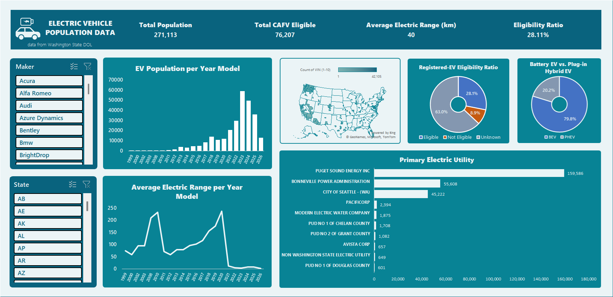
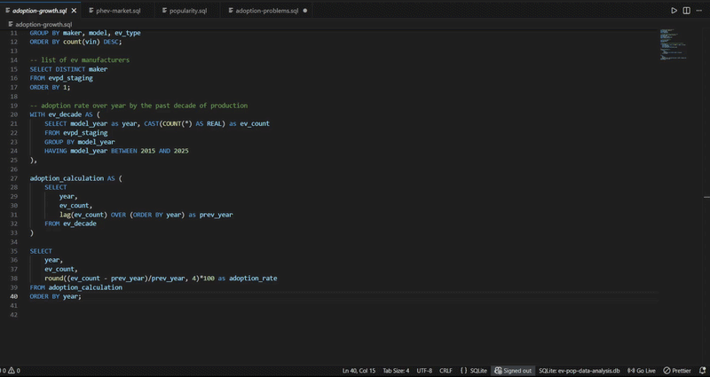

# Washington State Electric Vehicle Population Analysis
An End-to-End Analysis: From Data Cleaning to Market Intelligence

## Project Overview

This project investigates the adoption, technological evolution, and eligibility trends of the **Electric Vehicle (EV)** market in *Washington State DOL*. Using a dataset of 240,000+ records, I navigated the full data lifecycle, from **initial cleaning** in **Excel** to complex relational querying in **SQL (SQLite)**, to uncover the narratives driving the shift toward electrification and pipelining to **Power BI** for data storytelling.

## Tech Stack

**Data Preparation:**   Microsoft Excel (`XLOOKUP`, Mapping Tables, Pivot Tables)

**Data Analysis:**  SQL (SQLite / DB Browser), Microsoft Excel (Pivot Tables, Interactive Dashboard)

**Data Visualization:** Microsoft Excel, Microsoft Power BI (Executive Overview Dashboard)

**Key Techniques:** Pivot Tables, Window Functions (`LAG`), CTEs, Conditional Aggregation, Implicit Casting, Data Cleaning, Data Transformation, Data Pipeline, Business Intelligence.

## Part 1: The Excel Foundation

Before analysis, I built a **Scalable Data Pipeline** and **Interactive Dashboard** to resolve widespread naming inconsistencies and "False Zeros" in the dataset using [Microsoft Excel](excel/README.md).

**Automated Standardization:** Utilized `XLOOKUP` with a central Mapping Table to fix ~7,600 "messed up" records (e.g., standardizing Bolt Ev to Bolt EV and Bz4x to bZ4X).

**Initial Finding:** Identified a 130% technological leap in average electric range in 2008, correlating to the introduction of high-capacity Lithium-Ion batteries from Tesla's Roadster model.

## Part 2: SQL Deep Dives

Transitioning to [SQLite](sql/), I performed advanced queries to analyze market velocity and segments.

#### Adoption Velocity (YoY Growth):

- Focused on the Modern Era (2015–2025) to eliminate statistical noise from early outliers.
Insights: Traced the "Holy Trinity" of hybrid hypercars in 2015 and the mass-market explosion triggered by the Tesla Model 3 in 2017.
Technique: Used `LAG()` window functions to calculate the acceleration of adoption.

#### The PHEV Renaissance

- Analyzed the market share of Battery Electric (BEV) vs. Plug-in Hybrid (PHEV).
Insights: Discovered a massive second wind for PHEVs starting in 2020, driven by the SUV boom. The Jeep Wrangler 4xe emerged as a dominant market leader (2022–2024), proving that PHEVs are a preferred "bridge" for American SUV consumers.

### Data Limitations & Integrity (The "Eligibility Flaw")

A critical part of this analysis was uncovering the CAFV Eligibility Gap. While stakeholders rely on this data for incentive planning, the dataset contains a significant flaw:

The **"Unknown"** Majority: Over 63% of registered EVs are labeled with *"Unknown Eligibility."*

The **Cause**: This is primarily due to a 0-mile range representation in newer models (2021–2025) caused by shifting data maintenance policies and missing manufacturer technical specs.

The **Irony**: Tesla, despite its market dominance, holds the highest volume of "Unknown" records.

The **Reality**: Currently, only 28% of the dataset clearly reflects vehicles benefiting from CAFV incentives, suggesting that the data significantly underrepresents the actual number of eligible vehicles on the road.

### Key Findings

- Market Leadership: Tesla remains the volume leader, but the competitive landscape is shifting toward performance SUVs.

- Tech Maturity: Average battery range has evolved from a *"commuter niche"* (under 100 miles) to a "road-trip capable" standard (200+ miles).

- Incentive Gap: Data reporting lags are masking the true reach of tax incentives, creating a "blind spot" for policymakers. *(Which later on will be resolved in the 3rd part of the project, PowerBI)*

## Part 3: PowerBI - Executive Overview

Moving forward to a powerful business intelligence and visualization tool, I decided to build an **Executive Overview** dashboard intended for *Policy Makers* and *Government* bodies in policy and decision making by gaining insights from extensive analysis of the data using [Microsoft Power BI](powerbi/).

https://github.com/user-attachments/assets/292f0fc8-06a5-4dc4-b669-2cc0f5df395f

To showcase a work-ready capability, instead of importing csv-formatted dataset to *Power BI* I've used *SQLite3 ODBC Driver* to connect the tool to *SQLite* that contains all the data and schema built from previous part. Ensuring a secure and scalable pipeline I've built a structured *View Table* containing necessary columns as a data source for the viz tool, emulating a real DA work and approach to databases and tools.

### Solving the "Eligibility Flaw"

- Handling the 0-mile range issue for newer BEV models by setting them as `NULL` to avoid including them when averaging electric range of BEVs while still being included to the total CAFV eligible EVs.
- Going an extra step by adding a *tooltip* as Help icon stating an important note from the *State of Washington Open Data* who maintains the EV population dataset. 

### Visualization and Storytelling

- **Main KPIs**: From the perspective of my intended audience, I've picked 3 KPIs that would help them in policy and decision-making in nationwide, categorical, entity (maker), and granular viewpoint.:

    1. **Total EVs**: Count of total electric vehicles. *How many have adopted to electric vehicles in the modern era?*
    2. **Eligibility %**: Percentage/ratio of CAFV eligible electric vehicles. *How many electric vehicle owner are getting incentivized?*
    3. **Average Electric Range**: Mean of electric range capacity of a fleet. *How capable are these electric vehicles for the modern era of vehicles?*

- **Charts and Graphs**: I've chosen 4 specific visualizations appropriate to the narrative I wanted to convey:

    1. **Stacked Area Graph**: Treating the 'model_year' as more of a category rather than a time series (date), using an area graph to visualize **population** of electric vehicles with the distinction between BEVs and PHEVs to compare the **adoption** of both EVs.
    2. **100% Stacked Area Chart**: Instead of using a basic pie chart in answering the question *"How many EV owners are getting incentivized?,"* I've gone to use 100& stacked area chart that shows the **eligibility ratio** between year models of EV.
    3. **Treemap**: *Which car maker dominates the population of Electric Vehicles in the modern era?"* By using treemap to visualize each **makers** and their **population share** also highlighting the domination using dark colors for dominant entities and lighter colors for small-share entities. 
    4. **Map**: Showing **geographic location** of registered electric vehicles on the map indicating which states/cities are adapting by **volume of EVs**.

## Let's Connect!

If you appreciate the project, feel free to message me for inquiries, questions, and possible job opportunities! ❤️

- LinkedIn: [John Matthew Villanueva](https://www.linkedin.com/in/jmateovill/)
- Email: (Gmail) jmateo.vill@gmail.com, (Outlook) jmateo.vill@hotmail.com
