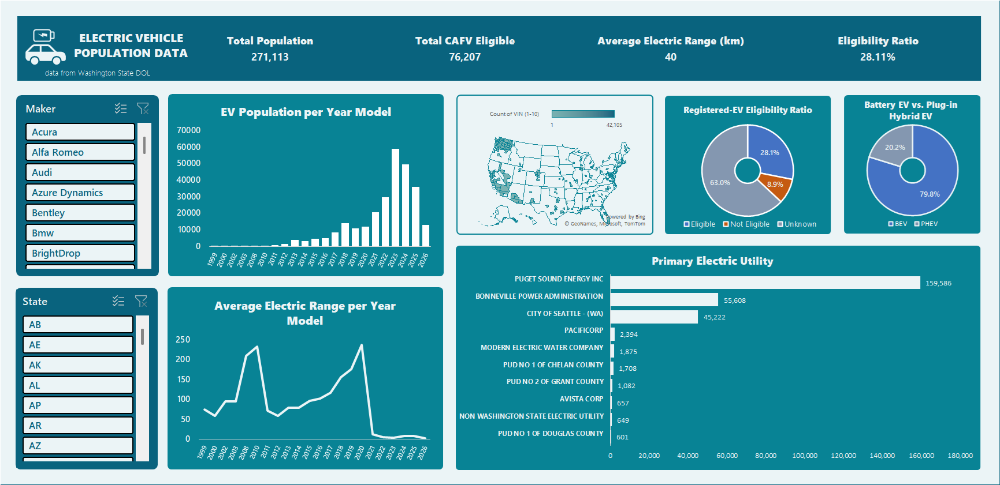
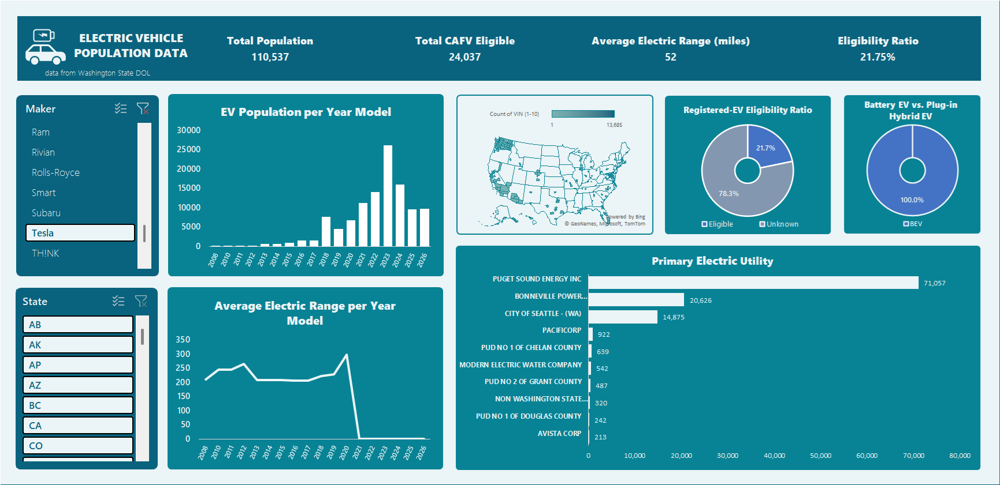
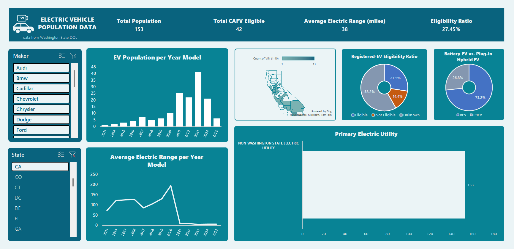

# [EXCEL] Electric Vehicle Population Data Analysis: End-to-end Data Cleaning to Interactive Dashboard

This project analyzes the adoption and technological evolution  of Electric Vehicles (EV) throughout the years, utilizing 270K+ record dataset from Washington State Department of Licensing (DOL) from [Data.gov](   https://data.wa.gov/d/f6w7-q2d2).

## Tools & Techiniques
- **Tool:** Microsoft Excel
- **Functions:** `XLOOKUP`, `PROPER`, `SUBSTITUTE`, `TEXTBEFORE`, `IFERROR`, `UNIQUE`, `COUNTA`.
- **Features:** Interactive Dashboard with KPIs, Pivot Tables, Mapping Table, & Slicers.

## Data Preparation & Cleaning
1. **Automated Name Standardization:** Developed a **Scalable Mapping Table** to fix model names (e.g., converting `Bolt Ev` to `Bolt EV` and `Bz4x` to `bZ4X`) using `XLOOKUP`. This ensured data integrity across 7,600+ records.
2. **Logic Validation:** Created a multi-condition formula to handle `0` and `NA` values in the **Electric Range** column, ensuring "Clean Alternative Fuel Vehicle (CAFV)" eligibility was accurately reported.
3. **Primary Utility Extraction:** Used `TEXTBEFORE` logic to isolate primary energy providers from complex strings (e.g., `PUGET SOUND ENERGY INC||CITY OF TACOMA`).

## Key Insights
1. **2008 Technological Leap:** A significant increase on the average of Electric Range of EVs from **95 miles (2003)** to **220 miles (2008)** due to Tesla's introduction of high capacity Lithium-ion Battery Powered EV, the *"Tesla Roadster."*
2. **Market Dominance:** Through the years, **Tesla** remains the *"Gold Standard"* for range and volume, with **Nissan** maintaining a strong secondary position in the commuter-EV segment.
3. **Leading Electric Utility:** **Puget Sound Energy Inc** is the #1 utility provider, supporting the majority of the state's EV infrastructure.

## Dashboard

